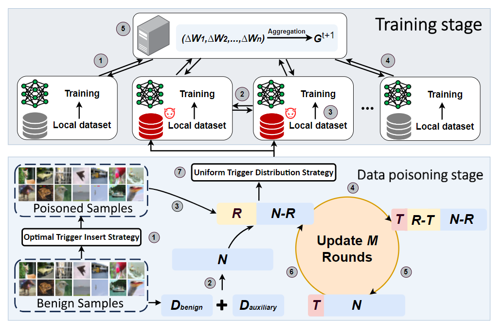

# SADBA
This repo contains the implementation for the paper "SADBA: Self-Adaptive Distributed Backdoor Attack against Federated Learning".

<p align="center">
  
  <br>
  <span>Figure 1: Overview of self-adaptive distributed backdoor attack (SADBA) in FL.</span>
</p>


## Requirements
```bash
Python >=3.8
PyTorch >= 1.12.1
NumPy >= 1.21.5
```

## Datasets
The experiment in this repository utilizes the Fashion-MNIST dataset.

## Folder Structure
The repository is organized as follows:
```bash
.
├── data                        # Data Storage
├── models                      # Supported models
├── saved_models                # Save experimental data
├── task_params                 # Experimental configuration folder
├── helper.py                   # A utility module designed to assist in the training and communication of deep learning models.
├── client.py                   # Define each client information and local training process.
├── server.py                   # Defined a function for global aggregation in FL.
├── preparation.py              # Loading module for FL.
├── common.py                   # Code reconfiguration and refine function for saving experiment data.
├── data_manage.py              # Data management module.
├── main.py                     # Federated framework main function
├── test.py                     # Test class functions to test model performance

```

## How to run:
To start the experiment, simply run the following command:
```bash
python main.py
```

## Optional Parameters
There are a several of optional arguments in the `./task_params/Fashion_MNIST/config.yaml`:
 - `PMC`:Percentage of malicious clients.
 - `trigger_pattern`:Number of trigger partition.
 - `setting`:Trigger shape.
 - `local_epoch`:Default client training rounds per round.
 - `poison_internal_poison_epochs`:Malicious clients have training rounds per round.
 - `scale_weights_poison`:Malicious client amplifies parameters.
 - `num_select_clients`:Number of selected clients per round.
 - `X_poison_epochs`:The X-th type trigger malicious client adds a round.
 - `dirichlet_alpha`:If you choose to partition the client using the Dirichlet distribution, this is the coefficient.
 - `target_label`:Malicious client target label.


